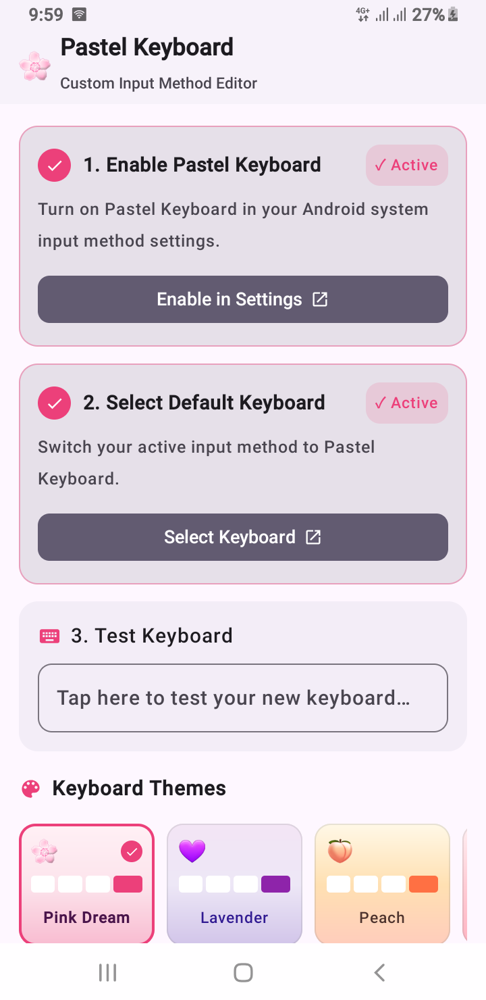

# 🌸 Pastel Keyboard

A cute, pastel themed custom Android keyboard (IME) built entirely with **Kotlin & Jetpack Compose**: smart enough to behave correctly across real messaging apps like WhatsApp, while staying light, fast, and fully offline.

---

## 🎬 App Demo

<p align="center">
  <a href="https://youtube.com/shorts/W0GiAuVKZes">
    
  </a>
</p>
*Click the screenshot above to watch the app in action on YouTube.*

---

## ✨ Features

* **5 handcrafted pastel themes**: Pink Dream, Lavender, Peach, Rose, and a dark Midnight mode, each with its own gradient background, key colors, and accent tones.
* **Smart IME action detection**: automatically shows the correct action key (Enter / Send / Search / Go / Next / Done) based on the field you're typing in, so multiline chat boxes correctly get a real Enter key instead of always showing "Done".
* **Accurate auto capitalization**: capitalizes the first letter of sentences based on the field's input type and cursor position, with a reliable single tap Shift and a double tap Caps Lock.
* **Emoji keyboard** with a dedicated recent emojis tray.
* **Lightweight word suggestions** as you type.
* **Adjustable keyboard height**: Small, Normal, Large.
* **Sound & haptic feedback**, toggleable independently.
* **Key popup preview** toggle for tap feedback.
* **Numbers & symbols layouts** alongside the main letter layout.
* **In app settings screen** that shows whether the keyboard is enabled and set as default, with one tap shortcuts into system settings.
* **Theme switch shortcut** directly from the keyboard itself.
* 100% offline: no network permissions, no data collection.

---

## 🛠️ Tech Stack

* **Kotlin**
* **Jetpack Compose** (UI rendered inside an `InputMethodService` via `ComposeView`)
* **DataStore (Preferences)** for persisting theme, height, and toggle settings
* **Coroutines / StateFlow** for reactive state across the keyboard and settings screen
* **Material 3** components for the settings screen
* **AndroidX Core Splashscreen**

---

## 📁 Project Structure

```
com.example
├── data/          # DataStore backed preferences (theme, height, sound, haptics, popup)
├── ime/           # The InputMethodService, InputConnection wrapper, IME action & suggestion logic
├── model/         # Enums & data models (ShiftState, KeyboardMode, KeyboardHeight, Theme, Key)
├── ui/keyboard/   # Compose UI for letters, numbers, symbols, and the emoji keyboard
├── ui/settings/   # The companion app's settings screen + ViewModel
├── ui/theme/      # App level Material theme (colors, typography)
└── util/          # EditorInfo/input type helpers, sound & haptic feedback manager
```

---

## 🚀 Getting Started

1. Clone the repository and open it in **Android Studio** (latest stable version recommended).
2. Let Gradle sync and build the project.
3. Run the app on a device or emulator: this installs the companion settings app.
4. From the app, tap **Enable Keyboard** to turn it on in system settings, then **Set as Default** to start typing with it anywhere.

---

## ⌨️ Enabling the Keyboard Manually

If you'd rather do it without the in app shortcuts:

1. Go to **Settings → System → Languages & input → On screen keyboard**.
2. Enable this keyboard from the list.
3. Switch to it from the keyboard switcher icon (globe/keyboard icon) in any text field, or set it as your default input method.

---

This project's code was developed with the help of AI.

---

## 👨‍💻 Developer

Built by **[Farhan Saeed (Al Saeed Dev)](https://alsaeeddev.com)**: freelance Android & Flutter developer.

📩 For freelance work, DM on Instagram: **[@alsaeeddev](https://instagram.com/alsaeeddev)**
